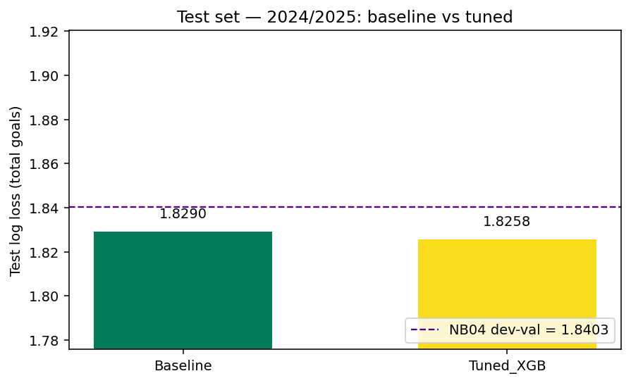
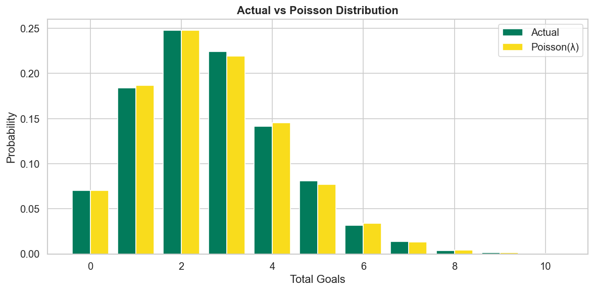
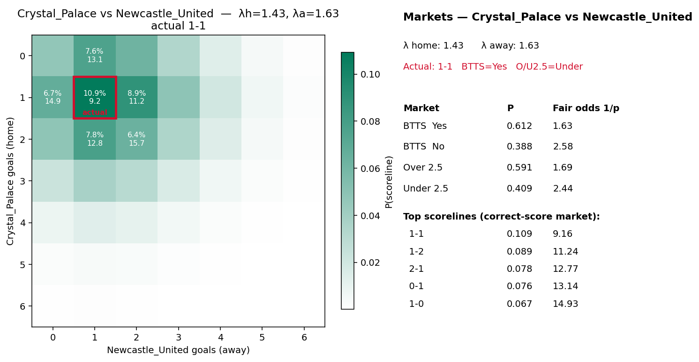

# Total Goals Model — English Football (PL, Championship, League One)

A model that predicts the **total goals** in a match as a full probability distribution rather than a point estimate, built across a five notebook pipeline that runs end-to-end from raw `match_data.csv` to a held out test evaluation.

---

## Summary

- **On par with a strong league-average Poisson baseline** on total goals and reaching that ceiling matters, because the baseline is near-optimal (explained below).
- **Produces far more than the baseline:** per-team scoring rates, a full scoreline matrix, and every derived market (1X2, BTTS, any Over/Under line) from one coherent object.
- **Consistent edge on the Over/Under markets.**
- **Deliberately simple** with five features, modest tuning, nothing hard-coded and fully reproducible.

---

## Key results

Held-out test set (**2024/25 + 2025/26, 2,488 fixtures**):

| Metric | Baseline | Model |
|---|---|---|
| Total-goals log loss | 1.8290 | 1.8258 |

- The model's **0.003 log-loss/match** edge on total goals is **not statistically significant** (bootstrap 95% CI ≈ [−0.002, +0.008], Wilcoxon p ≈ 0.35).
- **No overfitting:** test (1.826) beats training validation (1.840).
- **Over/Under discrimination beats the baseline on every line** (AUC ~0.55–0.58 vs ~0.53–0.55), with lower O/U log loss throughout.

*Model and baseline effectively level on total goals, both under the training validation line.*

**Why the baseline is so strong (and matching it is the real result):** total goals show variance ≈ mean (~0.99), so almost all variation is **irreducible Poisson noise** and very little is predictable signal. The league average is therefore already a near-optimal rate, leaving little room above it for any model.

*Observed totals track a single Poisson closely, the basis for the baseline's strength.*

**What the model gives that a baseline can't**: a single fixture, fully priced from one scoreline matrix (scorelines, BTTS, O/U with fair odds):

---

## How to run

- **Python 3.10+** and Jupyter.
- `pip install pandas numpy scipy scikit-learn xgboost matplotlib seaborn jupyter`
- Place `match_data.csv` in the input path at the top of `01_EDA.ipynb`.
- Run **in order, 01 → 05** (each notebook reads the previous one's saved artifacts).
- Seed is fixed (`RANDOM_SEED = 2026`). If a search grid in `04` changes, run once with `CLEAR_CACHE = True`.

---

## Notebooks & methodology

| Notebook | Writes |
|---|---|
| `01_EDA` | diagnostics |
| `02_Cleaning` | `df_cleaned.csv` |
| `03_Features` | `selected_features.json`, `run_config.json` |
| `04_Tuning` | `tuning_best.json` |
| `05_Evaluation` | `test_metrics*.csv`, figures |

**01 — EDA**
- Running all EDA on a **training split** (seasons before 2024/25), so the held-out test seasons inform no exploratory decision.
- Profiling the target distribution and confirming its Poisson shape (variance/mean ≈ 0.99).
- Mapping xG coverage by league and season; quantifying home advantage and the crowd/Covid effect.
- Building team goal-profile views to understand spread across sides.

**02 — Cleaning**
- Typing, de-duplication, and range/validity checks before anything downstream.
- Resolving missing xG in two cases: a few stray nulls verified against source as true `0.0` (filled); League One 2018/19 had no xG tracking (left `NaN`, flagged, excluded from modelling).

**03 — Features**
- Splitting each match into **two rows (one per team)**, with the target being that team's goals, then re-pairing by match to form the scoreline.
- Starting from **26 broad features**: team attack/defence and opponent attack/defence (each in goals and xG, all-venue and venue-specific variants), venue-aware league priors, contextual markers (home/away, crowds, game-week, league), and promotion/relegation movement flags.
- Computing the team/opponent priors as rolling averages over the last **L** matches with exponential **decay (ALPHA)**, so recent form weighs more; League One's cold start is seeded from the prior season.
- Compressing 26 → **5 features** via grouped, walk-forward-CV-driven selection (SHAP as a tie-breaker only).

**04 — Tuning**
- Tuning the shared prior **(L, ALPHA)** on a grid, then XGBoost hyperparameters via a 4-block pairwise coordinate descent, **on validation only**, with a stability re-check.
- Grid searches cached for fast, reproducible re-runs.

**05 — Evaluation**
- Scoring the held-out test seasons **once**: total goals plus derived markets (1X2, BTTS, O/U).
- Checking calibration (reliability diagrams + ECE) and testing the edge with a paired bootstrap and Wilcoxon test.

---

## Key decisions

- **Modelling each team's goals, then multiplying the two into a scoreline distribution**: rather than modelling the total directly, I used the same scoreline matrix prices every market at once, and all prices stay mutually consistent.
- **A Poisson family, chosen from the data**: the ~0.99 variance/mean ratio justifies a Poisson objective and Poisson score distributions empirically, not by convention.
- **Length-L window with decay-ALPHA priors**: rolling team rates that weight recent form more heavily; L and ALPHA are tuned, not assumed.
- **A deliberately compact feature set**: selection keeps the *smallest* subset within CV-noise tolerance of the best loss, because chasing the absolute-best number would fit noise; the compact set is stabler and cheaper to run.
- **A league-average baseline as the benchmark**: naive by design, but near-optimal given the Poisson structure, so an honest bar to clear.
- **Strict leakage control**: EDA on training data, features recorded before each match enters the rolling buffers, expanding-window CV by season, and the last two seasons held out and touched once.
- **Log loss as the primary metric**: a proper scoring rule that grades the whole distribution, which is what matters for pricing.

---

## Limitations

- **Goal independence**: the scoreline distribution multiplies the two teams' score distributions as if independent, so 1X2 / correct-score prices in the low-score region are approximate (draws slightly under-predicted). Minimal impact on totals.
- **Conditional Poisson assumption**: checked only indirectly, via market calibration.
- **Limited input data**: the dataset contains no betting odds and no team-sheet, injury, rest, or in-play information, so the model works from pre-match aggregates only.

---

## Future improvements

- **Dixon-Coles / bivariate-Poisson correction**: tested in development; it didn't improve *total-goals* log loss (the total washes out the low-score correlation), so it was left out for simplicity. It's the natural next step to sharpen 1X2 and correct-score.
- **Richer data schema**: the biggest lever: player-level availability, play-style / tactical features, and richer shot quality such as xGOT (separating chance creation from finishing), none of which pre-match team averages can capture.
- **Market benchmark**: with closing odds, evaluate against the closing line (CLV).
- **Stronger baseline**: a Poisson team-strength model fit by MLE, as a fairer bar than the league average.
